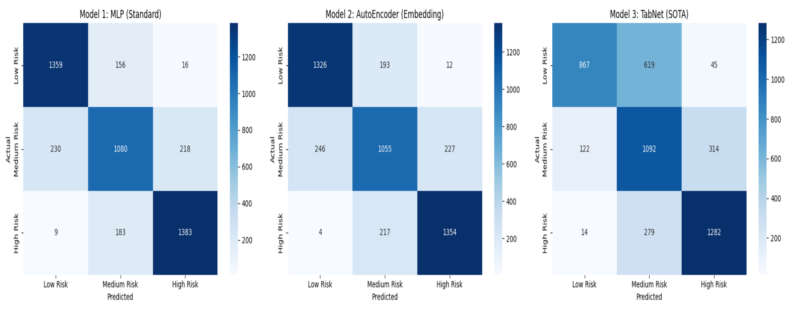
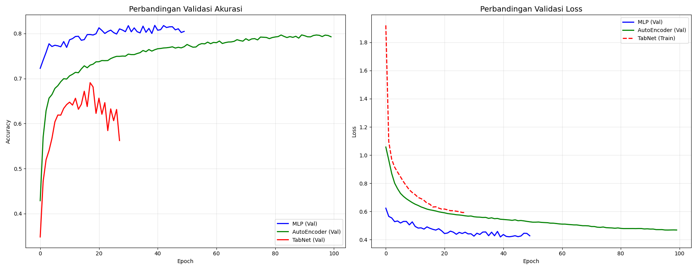

# COVID-19 AI RISK CLASSIFICATION SYSTEM


## 📑 Table of Contents
1. [Judul](#covid-19-ai-risk-classification-system)
2. [Deskripsi Proyek](#-deskripsi-proyek)
3. [Sumber Dataset](#-sumber-dataset)
4. [Preprocessing Data](#-preprocessing-data)
5. [Arsitektur Pemodelan](#-arsitektur-pemodelan)
6. [Hasil Evaluasi & Analisis](#-hasil-evaluasi--analisis)
7. [Langkah Instalasi & Penggunaan](#-langkah-instalasi--penggunaan)

---

## 📝 Deskripsi Proyek

### Latar Belakang
Pandemi COVID-19 telah menjadi tantangan global yang menuntut respons cepat dan akurat dari pemerintah serta institusi kesehatan. Salah satu kendala utama dalam penanganan pandemi adalah sulitnya memetakan tingkat risiko suatu wilayah secara *real-time* akibat banyaknya variabel yang mempengaruhi, mulai dari data epidemiologi (seperti jumlah kasus aktif dan kematian) hingga data demografi (kepadatan penduduk). Analisis manual terhadap data multivariat ini seringkali memakan waktu dan rentan terhadap *human error*.

Oleh karena itu, diperlukan sebuah sistem cerdas berbasis *Artificial Intelligence* (AI) dan *Machine Learning* yang mampu mengolah data tabular yang kompleks menjadi wawasan yang dapat ditindaklanjuti. Proyek ini mengembangkan sebuah *Decision Support System* (Sistem Pendukung Keputusan) yang memanfaatkan algoritma *Deep Learning* untuk memprediksi risiko wilayah secara otomatis. Sistem ini tidak hanya memberikan label risiko, tetapi juga menyajikan analisis probabilitas untuk membantu pemangku kepentingan dalam memprioritaskan alokasi sumber daya medis.

### Status Kategori Risiko
Sistem ini mengklasifikasikan wilayah ke dalam tiga kategori risiko berdasarkan tingkat keparahan parameter input:
* **Low Risk (Risiko Rendah):** Wilayah dengan penyebaran terkendali, tingkat kesembuhan tinggi, dan beban fasilitas kesehatan yang minim.
* **Medium Risk (Risiko Sedang):** Wilayah yang mulai menunjukkan tren kenaikan kasus dan memerlukan pengawasan ketat untuk mencegah eskalasi.
* **High Risk (Risiko Tinggi):** Wilayah dengan transmisi virus yang masif, tingkat kematian tinggi, dan kepadatan penduduk yang memperburuk laju penularan.

### Tujuan Pengembangan
1.  **Dashboard Interaktif:** Membangun antarmuka web berbasis Streamlit yang memungkinkan pengguna melakukan prediksi risiko secara *real-time* (Single Prediction) maupun massal (Batch Forecasting).
2.  **Studi Komparasi Model:** Menganalisis efektivitas tiga arsitektur berbeda (**MLP, AutoEncoder, TabNet**) dalam menangani data tabular COVID-19.
3.  **Explainable AI:** Menyediakan visualisasi yang transparan mengenai performa model dan alasan di balik prediksi yang dihasilkan.

---

## 💾 Sumber Dataset
- *Judul Dataset : COVID-19 Indonesia Dataset*
- *Link : [Kaggle COVID-19]([https://kaggle.com)(https://www.kaggle.com/datasets/hendratno/covid19-indonesia).*
  
Dataset ini merupakan data sekunder yang menghimpun statistik harian COVID-19 di berbagai wilayah. Data ini mencakup kombinasi antara:
* **Data Epidemiologi:** Mencakup metrik vital penyebaran penyakit seperti *Total Active Cases*, *Cases per Million*, *Deaths per Million*, *Fatality Rate*, *Recovered Rate*, dan *Growth Factor*.
* **Data Demografi & Geografis:** Mencakup karakteristik wilayah seperti *Population Density* (kepadatan penduduk), *Total Cities/Regencies*, serta titik koordinat (*Longitude* dan *Latitude*).

Dataset ini memiliki karakteristik tabular dengan fitur numerik yang dominan, sehingga memerlukan teknik preprocessing khusus agar dapat diproses oleh *Neural Network*.

---

## 🛠 Preprocessing Data

Sebelum data dimasukkan ke dalam model, dilakukan serangkaian tahapan pra-pemrosesan untuk memastikan kualitas dan konsistensi data.

### 1. Pemilihan Kolom (Feature Selection)
Memisahkan data menjadi Fitur Input (X) dan Target Output (Y):
| Nama Variabel | Peran | Deskripsi |
| :--- | :---: | :--- |
| **Total Active Cases** | X | Jumlah pasien positif aktif saat ini. |
| **Cases per Million** | X | Normalisasi kasus per 1 juta penduduk. |
| **Deaths per Million** | X | Normalisasi kematian per 1 juta penduduk. |
| **Population Density** | X | Kepadatan penduduk per km². |
| **Growth Factor** | X | Rasio pertumbuhan kasus harian. |
| **Fatality Rate** | X | Persentase tingkat kematian. |
| **Recovered Rate** | X | Persentase tingkat kesembuhan. |
| **Total Cities** | X | Jumlah kota administratif. |
| **Total Regencies** | X | Jumlah kabupaten administratif. |
| **Longitude** | X | Koordinat Garis Bujur. |
| **Latitude** | X | Koordinat Garis Lintang. |
| **Risk Level** | Y | Target klasifikasi (0=Low, 1=Medium, 2=High). |

### 2. Data Preprocessing
Tahap pra-pemrosesan dilakukan secara komprehensif untuk menjamin kualitas data sebelum masuk ke model:
* Data Cleaning: Melakukan pemeriksaan dan penanganan terhadap missing values (imputasi) serta menghapus data duplikat untuk menjaga integritas dan mencegah bias pada model.
* Feature Selection: Memilih fitur-fitur yang paling relevan (11 fitur input) dan membuang atribut yang tidak diperlukan (seperti nama lokasi atau ID) untuk mengurangi noise.
* Target Encoding: Mengubah variabel target (Risk Level) yang bersifat kategorikal (Low, Medium, High) menjadi format numerik (0, 1, 2) agar dapat diproses oleh algoritma pembelajaran mesin.
* Scaling: Menerapkan StandardScaler pada fitur numerik. Langkah ini sangat krusial karena rentang nilai antar fitur sangat variatif (contoh: Growth Factor berkisar 0-5, sementara Population Density bisa mencapai ribuan). Scaling menstandarisasi data agar memiliki mean 0 dan standar deviasi 1, yang membantu algoritma optimasi konvergen lebih cepat dan stabil.

### 3. Splitting Data
Dataset yang berjumlah 31.822 baris dibagi menjadi tiga bagian terpisah menggunakan rasio 70:15:15 untuk memastikan evaluasi yang objektif:
* Training Set (70%): Digunakan sepenuhnya untuk melatih model dalam mempelajari pola antar fitur dan target.
* Validation Set (15%): Digunakan saat proses pelatihan (during training) untuk menyetel hyperparameter dan memantau performa model guna mencegah overfitting.
* Test Set (15%): Data "unseen" (benar-benar baru) yang hanya digunakan satu kali di akhir proses untuk mengevaluasi performa generalisasi model secara final (apakah model bias atau tidak).

---

## 🧠 Arsitektur Pemodelan

Proyek ini membandingkan tiga pendekatan arsitektur *Deep Learning* yang berbeda karakteristiknya:

### 1. Multi-Layer Perceptron (MLP) - Baseline
MLP adalah bentuk paling dasar dari *Deep Learning* yang terdiri dari lapisan input, beberapa lapisan tersembunyi (*hidden layers*), dan lapisan output. Dalam arsitektur ini, setiap neuron terhubung sepenuhnya (*fully connected*) dengan neuron di lapisan berikutnya. MLP bekerja dengan memetakan hubungan non-linear antara fitur input dan label output melalui fungsi aktivasi seperti ReLU.

Pada kasus data tabular dengan jumlah fitur yang terbatas (11 fitur), MLP seringkali menjadi pilihan terbaik karena kesederhanaannya. Model ini mampu mempelajari pola data secara langsung tanpa memerlukan transformasi struktur yang rumit. Dalam eksperimen ini, MLP digunakan sebagai *Baseline* untuk mengukur seberapa baik performa model standar dibandingkan model yang lebih kompleks.

### 2. AutoEncoder - Transfer Learning
AutoEncoder adalah arsitektur jaringan saraf yang awalnya dirancang untuk pembelajaran tanpa pengawasan (*unsupervised learning*). Model ini bekerja dalam dua tahap. Tahap pertama adalah **Pretraining**, di mana model belajar mengompresi data input menjadi representasi laten (*encoding*) dan merekonstruksinya kembali. Proses ini memaksa model untuk membuang *noise* dan hanya menyimpan fitur-fitur esensial dari data.

Tahap kedua adalah **Fine-Tuning** (Transfer Learning). Bagian *Decoder* dilepas, dan bagian *Encoder* yang sudah terlatih disambungkan dengan lapisan klasifikasi baru (*Classifier Head*). Pendekatan ini sangat efektif untuk menangani data yang memiliki variasi tinggi atau gangguan, karena model telah "memahami" struktur internal data sebelum diminta untuk melakukan klasifikasi risiko.

### 3. TabNet - State of the Art (SOTA)
TabNet adalah arsitektur modern yang dikembangkan oleh Google Cloud AI, dirancang khusus untuk data tabular. Berbeda dengan MLP konvensional, TabNet mengadaptasi mekanisme **Attention** (serupa dengan Transformer pada NLP). Mekanisme ini memungkinkan model untuk melakukan *Soft Feature Selection*, yaitu memilih secara dinamis fitur mana yang paling relevan untuk diproses pada setiap langkah keputusan (*decision step*).

Secara teoritis, TabNet menawarkan keunggulan dalam hal interpretabilitas dan performa tinggi. Namun, model ini dikenal sangat haus data (*data-hungry*). Kompleksitasnya yang tinggi membutuhkan jumlah sampel data yang sangat besar (jutaan baris) untuk dapat melatih parameter atensinya secara optimal. Dalam dataset skala menengah, TabNet seringkali menghadapi tantangan *overfitting* atau kesulitan konvergensi dibandingkan model yang lebih ringan.

---

## 📊 Hasil Evaluasi & Analisis

Evaluasi dilakukan menggunakan metrik **Akurasi** pada Data Test yang tidak pernah dilihat model sebelumnya. Berikut adalah ringkasan perbandingan performa ketiga model:

| Model | Akurasi | Status |
| :--- | :---: | :--- |
| **MLP (Baseline)** | **82%** | **Best Model** |
| AutoEncoder | 76% | Good |
| TabNet | 70% | Underfitting |

### Visualisasi & Analisis Detail

Berikut adalah visualisasi performa model menggunakan **Confusion Matrix** dan **Learning Curves**.

**Confusion Matrix** adalah tabel yang memvisualisasikan seberapa akurat model dalam memprediksi setiap kelas. Sumbu vertikal menunjukkan label asli (Actual), sedangkan sumbu horizontal menunjukkan label prediksi (Predicted). Warna yang lebih gelap pada diagonal utama menunjukkan jumlah prediksi benar yang tinggi. Kita dapat melihat di mana model sering melakukan kesalahan (misal: salah memprediksi 'High Risk' menjadi 'Medium Risk').


*(Gambar: Confusion Matrix perbandingan 3 model)*

**Learning Curves** (Grafik Akurasi & Loss) menunjukkan proses belajar model dari *epoch* ke *epoch*. Grafik ini sangat penting untuk mendeteksi apakah model mengalami *overfitting* (garis training terus membaik tapi validasi memburuk) atau *underfitting* (keduanya buruk).


*(Gambar: Grafik Loss dan Akurasi selama proses training)*

**Analisis Perbandingan:**
Berdasarkan hasil di atas, **MLP** keluar sebagai model terbaik dengan akurasi **82%**. Hal ini menunjukkan bahwa untuk dataset tabular dengan dimensi fitur yang tidak terlalu besar, arsitektur sederhana yang langsung memetakan input ke output bekerja lebih efisien. **AutoEncoder** menempati posisi kedua, membuktikan kemampuannya mengekstrak fitur, namun proses kompresi fiturnya mungkin menghilangkan sedikit informasi detail yang penting untuk klasifikasi. Sementara itu, **TabNet** memiliki performa terendah (70%), yang mengonfirmasi hipotesis bahwa model SOTA yang kompleks ini memerlukan dataset yang jauh lebih besar untuk bekerja optimal.

---

## 🚀 Langkah Instalasi & Penggunaan

Ikuti panduan berikut untuk menjalankan sistem website ini di komputer lokal Anda (Localhost).

### 1. Prasyarat Sistem
Pastikan Anda telah menginstal:
* Python (versi 3.8 hingga 3.10)
* Git

### 2. Clone Repository
Unduh kode sumber proyek ini ke komputer Anda:
```bash
git clone [https://github.com/username-anda/nama-repo-anda.git](https://github.com/username-
git clone [https://github.com/username-anda/nama-repo-anda.git](https://github.com/username-anda/nama-repo-anda.git)
cd nama-repo-anda
```

### 3. Install Dependensi
Proyek ini menggunakan PDM untuk manajemen dependensi yang lebih stabil. Jalankan perintah berikut untuk menginstal seluruh library yang dibutuhkan:
```bash
pdm install
```

4. Jalankan Aplikasi
Gunakan perintah pdm run untuk menjalankan aplikasi Streamlit di dalam lingkungan virtual PDM:
```bash
pdm run streamlit run app.py
```
Catatan: Pastikan nama file utama Anda sesuai. Jika Anda menggunakan main.py, gunakan perintah: pdm run streamlit run main.py

## 🖼️Tampilan Website
